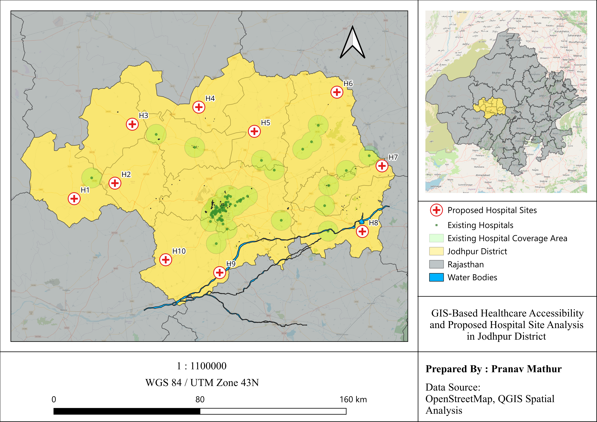

# GIS-Based Healthcare Accessibility and Proposed Hospital Site Analysis in Jodhpur District

## Project Overview

This project focuses on analyzing healthcare accessibility and identifying suitable locations for proposed hospitals in Jodhpur District using QGIS and spatial analysis techniques.

The study evaluates existing hospital coverage, underserved regions, and spatial suitability to improve healthcare accessibility planning.

This was one of my first complete hands-on GIS projects where I explored real-world geospatial problem solving using QGIS.

---

## Objectives

* Analyze existing healthcare coverage
* Identify uncovered and underserved areas
* Propose optimal hospital locations
* Perform GIS-based spatial analysis
* Create professional cartographic layouts

---

## Tools & Technologies

* QGIS
* GeoPackage (.gpkg)
* OpenStreetMap (OSM)
* Spatial Analysis
* Buffer Analysis
* Suitability Analysis

---

## Spatial Layers Used

* Proposed Hospital Sites
* Existing Hospitals
* Existing Hospital Coverage Area
* Jodhpur District Boundary
* Rajasthan Boundary
* Water Bodies
* Road Networks

---

## Methodology

1. Collection of spatial datasets and base maps
2. Preparation and organization of GIS layers
3. Mapping of existing hospitals
4. Creation of hospital coverage buffers
5. Identification of uncovered regions
6. Suitability analysis for new hospital locations
7. Preparation of thematic map layouts and visualization

---

## Challenges Faced

During the project, I encountered several practical GIS workflow challenges:

* Managing duplicate layers after packaging project data
* Symbology mismatch between geometry types
* Handling project portability using GeoPackage
* Maintaining map readability and cartographic balance
* Creating inset maps without overcrowding
* Managing layout synchronization between multiple map frames
* Styling and labeling multiple spatial layers efficiently

These challenges helped me better understand real-world GIS troubleshooting and project structuring.

---

## Key Learnings

Through this project, I learned:

* GIS project organization
* Layer styling and symbology
* Spatial data management
* GeoPackage workflows
* Cartographic design principles
* Buffer and coverage analysis
* Layout creation in QGIS
* Spatial visualization techniques
* Practical GIS problem-solving

---

## Final Output Map

---

## Repository Contents

| File                            | Description                            |
| ------------------------------- | -------------------------------------- |
| `project_hospital_coverage.qgz` | Main QGIS project file                 |
| `project_data.gpkg`             | GeoPackage containing spatial datasets |
| `Hospital_Site_Analysis.png`    | Final output map image                 |
| `Final_Map.pdf`                 | Exported printable map                 |
| `README.md`                     | Project documentation                  |

---

## Project Output

* Final thematic healthcare accessibility map
* Proposed hospital site identification
* Spatial coverage analysis
* GIS-based healthcare accessibility assessment
* Professional cartographic layout design

---

## Future Improvements

* Add population density analysis
* Include road network accessibility modeling
* Add travel-time based service area analysis
* Integrate demographic and healthcare statistics
* Develop interactive web GIS visualization

---

## Author

**Pranav Mathur**

Environment Engineer | GIS & Spatial Analysis Enthusiast
